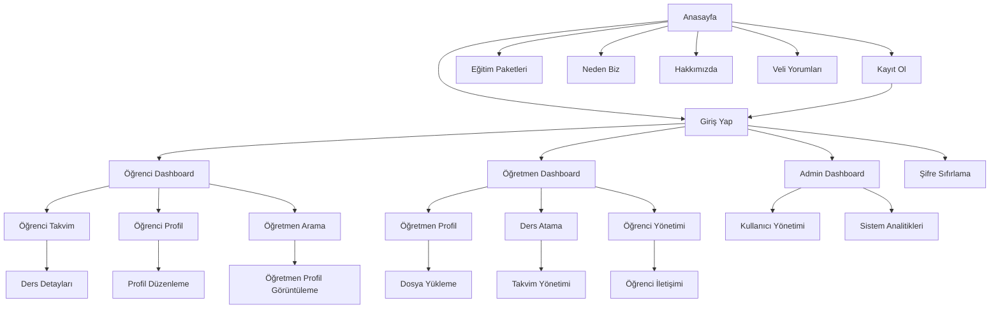

# Ders Atlası - Ürün Gereksinim Dokümanı

## 1. Ürün Genel Bakış

Ders Atlası, özel ders veren öğretmenler ile öğrencileri buluşturan dijital bir eğitim platformudur. Platform, öğrencilerin ders takvimlerini görüntüleyebileceği, öğretmenlerin profil oluşturup ders atayabileceği ve süper adminlerin tüm sistemi yönetebileceği kapsamlı bir çözüm sunar.

Platform, eğitim sektöründe dijital dönüşümü destekleyerek özel ders süreçlerini modernize etmeyi ve kullanıcı deneyimini optimize etmeyi hedefler.

## 2. Temel Özellikler

### 2.1 Kullanıcı Rolleri

| Rol         | Kayıt Yöntemi                   | Temel Yetkiler                                                   |
| ----------- | ------------------------------- | ---------------------------------------------------------------- |
| Öğrenci     | E-posta ile kayıt               | Ders takvimini görüntüleme, profil yönetimi, öğretmen arama      |
| Öğretmen    | E-posta ile kayıt + onay süreci | Profil oluşturma, ders atama, takvim yönetimi, öğrenci iletişimi |
| Süper Admin | Sistem tarafından atanan hesap  | Kullanıcı yönetimi, veri analizi, sistem konfigürasyonu          |

### 2.2 Özellik Modülleri

Ders Atlası platformu aşağıdaki ana sayfalardan oluşmaktadır:

**Genel Sayfalar:**

1. **Anasayfa**: Hero bölümü, platform tanıtımı, hızlı erişim menüleri
2. **Giriş Yap Sayfası**: Öğrenci ve öğretmen ayrı giriş seçenekleri, şifre sıfırlama
3. **Kayıt Ol Sayfası**: Rol seçimi, form validasyonu, e-posta doğrulama
4. **Eğitim Paketleri**: Paket listesi, fiyatlandırma, özellik karşılaştırması
5. **Neden Biz Sayfası**: Platform avantajları, başarı hikayeleri, istatistikler
6. **Hakkımızda Sayfası**: Şirket bilgileri, misyon-vizyon, ekip tanıtımı
7. **Veli Yorumları**: Kullanıcı deneyimleri, değerlendirmeler, testimonial
8. **Şifre Sıfırlama**: E-posta doğrulama, yeni şifre belirleme

**Öğrenci Sayfaları:**
9\. **Öğrenci Dashboard**: Ana panel, genel bakış, hızlı erişim
10\. **Öğrenci Takvim**: Ders takvimi, haftalık/aylık görünüm
11\. **Öğrenci Profil**: Profil yönetimi, kişisel bilgiler
12\. **Öğretmen Arama**: Öğretmen listesi, filtreleme, arama

**Öğretmen Sayfaları:**
13\. **Öğretmen Dashboard**: Ana panel, genel bakış, hızlı erişim
14\. **Öğretmen Profil**: Profil oluşturma, uzmanlık alanları
15\. **Ders Atama**: Ders planlama, takvim yönetimi
16\. **Öğrenci Yönetimi**: Öğrenci listesi, iletişim, ders geçmişi

**Admin Sayfaları:**
17\. **Admin Dashboard**: Ana panel, sistem genel bakışı
18\. **Kullanıcı Yönetimi**: Kullanıcı listesi, hesap durumu yönetimi
19\. **Sistem Analitikleri**: İstatistikler, raporlar, performans metrikleri

### 2.3 Sayfa Detayları

| Sayfa Adı           | Modül Adı          | Özellik Açıklaması                                         |
| ------------------- | ------------------ | ---------------------------------------------------------- |
| Anasayfa            | Hero Bölümü        | Logo, ana başlık, platform tanıtım metni ve CTA butonları  |
| Anasayfa            | Özellikler Bölümü  | Platform avantajları, ikonlar ve kısa açıklamalar          |
| Anasayfa            | İstatistikler      | Kullanıcı sayıları, başarı oranları, ders sayıları         |
| Giriş Yap           | Kimlik Doğrulama   | E-posta/şifre girişi, rol seçimi, "Beni Hatırla" seçeneği  |
| Giriş Yap           | Şifre Yönetimi     | Şifre sıfırlama linki, güvenlik doğrulaması                |
| Kayıt Ol            | Kullanıcı Kaydı    | Kişisel bilgiler, rol seçimi, şartlar ve koşullar onayı    |
| Kayıt Ol            | E-posta Doğrulama  | Doğrulama kodu gönderimi, hesap aktivasyonu                |
| Şifre Sıfırlama     | E-posta Doğrulama  | E-posta adres doğrulama, güvenlik kodu gönderimi           |
| Şifre Sıfırlama     | Yeni Şifre         | Yeni şifre belirleme, şifre güçlülük kontrolü              |
| Eğitim Paketleri    | Paket Listesi      | Farklı paket seçenekleri, fiyatlandırma, özellik listesi   |
| Eğitim Paketleri    | Karşılaştırma      | Paketler arası özellik karşılaştırma tablosu               |
| Neden Biz           | Avantajlar         | Platform güçlü yanları, rakip analizi, değer önerisi       |
| Neden Biz           | Başarı Hikayeleri  | Kullanıcı deneyimleri, başarı örnekleri                    |
| Hakkımızda          | Şirket Bilgileri   | Misyon, vizyon, değerler, şirket tarihi                    |
| Hakkımızda          | Ekip Tanıtımı      | Kurucu ve ekip üyeleri, uzmanlık alanları                  |
| Veli Yorumları      | Testimonial        | Kullanıcı yorumları, puanlama sistemi, fotoğraflı yorumlar |
| Veli Yorumları      | Değerlendirme      | Yıldız puanlama, kategori bazlı değerlendirme              |
| Öğrenci Dashboard   | Ana Panel          | Genel bakış, hızlı istatistikler, son aktiviteler          |
| Öğrenci Dashboard   | Navigasyon         | Sayfa geçişleri, menü yapısı, kullanıcı profil erişimi     |
| Öğrenci Takvim      | Takvim Görünümü    | Haftalık/aylık takvim, ders detayları, hatırlatmalar       |
| Öğrenci Takvim      | Ders Yönetimi      | Ders iptal/erteleme, öğretmen iletişimi                    |
| Öğrenci Profil      | Kişisel Bilgiler   | Ad, soyad, e-posta, telefon, fotoğraf güncelleme           |
| Öğrenci Profil      | Tercihler          | Ders tercihleri, bildirim ayarları, gizlilik               |
| Öğretmen Arama      | Filtreleme         | Konu, fiyat, müsaitlik, deneyim filtresi                   |
| Öğretmen Arama      | Profil Görüntüleme | Öğretmen detayları, değerlendirmeler, iletişim             |
| Öğretmen Dashboard  | Ana Panel          | Genel bakış, günlük program, gelir özeti                   |
| Öğretmen Dashboard  | Hızlı Erişim       | Ders ekleme, öğrenci mesajları, takvim görünümü            |
| Öğretmen Profil     | Profesyonel Bilgi  | Uzmanlık alanları, deneyim, sertifikalar, tanıtım metni    |
| Öğretmen Profil     | Dosya Yükleme      | CV, sertifika, profil fotoğrafı yükleme                    |
| Ders Atama          | Takvim Yönetimi    | Müsait saatler, ders planlama, tekrarlayan dersler         |
| Ders Atama          | Öğrenci Seçimi     | Öğrenci listesi, ders onayı, fiyat belirleme               |
| Öğrenci Yönetimi    | Öğrenci Listesi    | Aktif öğrenciler, ders geçmişi, iletişim bilgileri         |
| Öğrenci Yönetimi    | İletişim           | Mesajlaşma, bildirimler, ders notları                      |
| Admin Dashboard     | Sistem Genel Bakış | Kullanıcı istatistikleri, sistem durumu, son aktiviteler   |
| Admin Dashboard     | Hızlı Eylemler     | Kullanıcı onayı, sistem bildirimleri, raporlar             |
| Kullanıcı Yönetimi  | Kullanıcı Listesi  | Tüm kullanıcılar, filtreleme, arama, toplu işlemler        |
| Kullanıcı Yönetimi  | Hesap Yönetimi     | Hesap durumu, rol değişikliği, hesap silme                 |
| Sistem Analitikleri | İstatistikler      | Kullanım metrikleri, gelir raporları, performans analizi   |
| Sistem Analitikleri | Raporlama          | Grafik gösterimi, veri dışa aktarma, trend analizi         |

## 3. Temel Süreçler

### Öğrenci Akışı

Öğrenci platformda kayıt olduktan sonra profilini tamamlar, öğretmen arayabilir ve ders takvimini görüntüleyebilir. Öğretmenlerle iletişim kurarak ders randevusu alabilir.

### Öğretmen Akışı

Öğretmen kayıt olduktan sonra profilini oluşturur, uzmanlık alanlarını belirtir ve müsait olduğu saatleri takvimde işaretler. Öğrencilerden gelen talepleri değerlendirip ders atar.

### Süper Admin Akışı

Süper admin tüm kullanıcıları yönetir, sistem performansını izler ve gerekli düzenlemeleri yapar.

## 4. Kullanıcı Arayüzü Tasarımı

### 4.1 Tasarım Stili

* **Ana Renkler**: Mavi (#1E40AF - Primary), Turuncu (#EA580C - Secondary)

* **Buton Stili**: Yuvarlatılmış köşeler (8px border-radius), hover efektleri

* **Font**: Inter font ailesi, başlıklar için 24-32px, metin için 14-16px

* **Layout Stili**: Card-based tasarım, üst navigasyon, responsive grid sistem

* **İkon Stili**: Outline style ikonlar, Heroicons kütüphanesi önerisi

### 4.2 Sayfa Tasarım Genel Bakışı

| Sayfa Adı          | Modül Adı   | UI Elementleri                                                   |
| ------------------ | ----------- | ---------------------------------------------------------------- |
| Anasayfa           | Hero Bölümü | Gradient arkaplan, merkezi logo, büyük başlık, 2 adet CTA butonu |
| Anasayfa           | Özellikler  | 3 sütunlu grid, ikon + başlık + açıklama kartları                |
| Giriş Yap          | Form        | Merkezi form, mavi primary buton, sosyal medya giriş seçenekleri |
| Öğrenci Dashboard  | Takvim      | Haftalık grid görünümü, renk kodlu ders blokları, popup detaylar |
| Öğretmen Dashboard | Profil      | Sol sidebar profil, sağ taraf form alanları, fotoğraf upload     |
| Süper Admin        | Analytics   | Dashboard kartları, grafik gösterimi, tablo listeleri            |

### 4.3 Responsive Tasarım

Platform desktop-first yaklaşımla tasarlanacak ancak mobil uyumlu olacaktır. Tablet ve mobil cihazlarda touch-friendly butonlar ve optimized navigation kullanılacaktır.

* **Desktop**: 1200px+ tam özellikli layout

* **Tablet**: 768px-1199px collapsed sidebar, stack layout

* **Mobile**: 320px-767px hamburger menu, single column layout

