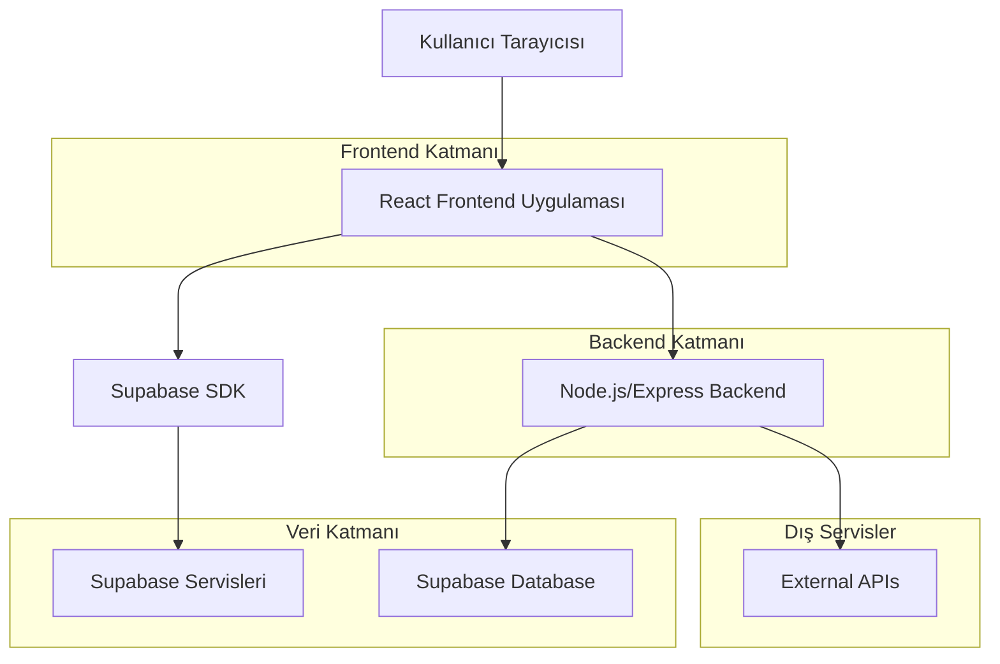
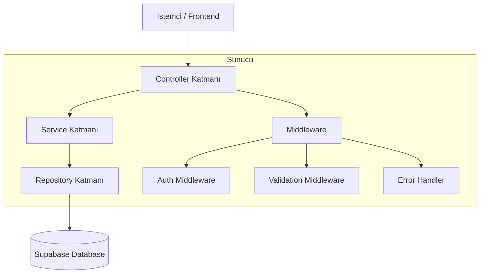
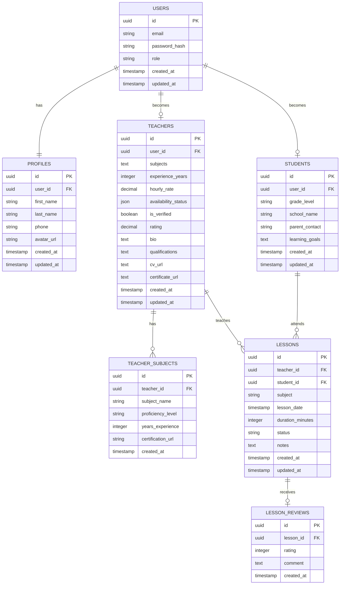

# Ders Atlası - Teknik Mimari Dokümanı

## 1. Mimari Tasarım



## 2. Teknoloji Açıklaması

- **Frontend**: React@18 + TypeScript + Tailwind CSS@3 + Vite + React Router
- **Backend**: Node.js + Express@4 + TypeScript
- **Veritabanı**: Supabase (PostgreSQL)
- **Kimlik Doğrulama**: Supabase Auth
- **Dosya Depolama**: Supabase Storage
- **State Yönetimi**: Zustand
- **Form Yönetimi**: React Hook Form + Zod
- **UI Kütüphanesi**: Headless UI + Heroicons

## 3. Route Tanımları

### 3.1 Genel Sayfalar
| Route | Amaç |
|-------|-------|
| / | Anasayfa, platform tanıtımı ve ana navigasyon |
| /login | Giriş sayfası, kullanıcı kimlik doğrulaması |
| /register | Kayıt sayfası, yeni kullanıcı kaydı |
| /reset-password | Şifre sıfırlama sayfası |
| /packages | Eğitim paketleri, fiyatlandırma bilgileri |
| /why-us | Platform avantajları ve özellikler |
| /about | Hakkımızda, şirket bilgileri |
| /testimonials | Veli yorumları ve değerlendirmeler |

### 3.2 Öğrenci Sayfaları
| Route | Amaç |
|-------|-------|
| /student/dashboard | Öğrenci ana paneli, genel bakış |
| /student/calendar | Öğrenci ders takvimi, haftalık/aylık görünüm |
| /student/profile | Öğrenci profil yönetimi, kişisel bilgiler |
| /student/teachers | Öğretmen arama ve listeleme, filtreleme |
| /student/lesson/:id | Ders detay sayfası, ders bilgileri |

### 3.3 Öğretmen Sayfaları
| Route | Amaç |
|-------|-------|
| /teacher/dashboard | Öğretmen ana paneli, genel bakış |
| /teacher/profile | Öğretmen profil yönetimi, profesyonel bilgiler |
| /teacher/schedule | Öğretmen ders atama ve takvim yönetimi |
| /teacher/students | Öğretmen öğrenci yönetimi, iletişim |
| /teacher/upload | Dosya yükleme sayfası (CV, sertifika) |

### 3.4 Admin Sayfaları
| Route | Amaç |
|-------|-------|
| /admin/dashboard | Admin ana paneli, sistem genel bakışı |
| /admin/users | Kullanıcı yönetimi, hesap durumu |
| /admin/analytics | Sistem analitikleri, raporlar |

## 4. API Tanımları

### 4.1 Kimlik Doğrulama API'leri

**Kullanıcı Kayıt**
```
POST /api/auth/register
```

İstek:
| Parametre | Tip | Zorunlu | Açıklama |
|-----------|-----|---------|----------|
| email | string | true | Kullanıcı e-posta adresi |
| password | string | true | Kullanıcı şifresi (min 8 karakter) |
| role | string | true | Kullanıcı rolü (student/teacher) |
| firstName | string | true | Ad |
| lastName | string | true | Soyad |

Yanıt:
| Parametre | Tip | Açıklama |
|-----------|-----|----------|
| success | boolean | İşlem durumu |
| user | object | Kullanıcı bilgileri |
| message | string | İşlem mesajı |

**Kullanıcı Giriş**
```
POST /api/auth/login
```

İstek:
| Parametre | Tip | Zorunlu | Açıklama |
|-----------|-----|---------|----------|
| email | string | true | Kullanıcı e-posta adresi |
| password | string | true | Kullanıcı şifresi |

Yanıt:
| Parametre | Tip | Açıklama |
|-----------|-----|----------|
| success | boolean | İşlem durumu |
| token | string | JWT access token |
| user | object | Kullanıcı bilgileri |

**Şifre Sıfırlama Talebi**
```
POST /api/auth/reset-password
```

İstek:
| Parametre | Tip | Zorunlu | Açıklama |
|-----------|-----|---------|----------|
| email | string | true | Kullanıcı e-posta adresi |

Yanıt:
| Parametre | Tip | Açıklama |
|-----------|-----|----------|
| success | boolean | İşlem durumu |
| message | string | İşlem mesajı |

**Şifre Güncelleme**
```
POST /api/auth/update-password
```

İstek:
| Parametre | Tip | Zorunlu | Açıklama |
|-----------|-----|---------|----------|
| token | string | true | Şifre sıfırlama token'ı |
| password | string | true | Yeni şifre (min 8 karakter) |

Yanıt:
| Parametre | Tip | Açıklama |
|-----------|-----|----------|
| success | boolean | İşlem durumu |
| message | string | İşlem mesajı |

**E-posta Doğrulama**
```
POST /api/auth/verify-email
```

İstek:
| Parametre | Tip | Zorunlu | Açıklama |
|-----------|-----|---------|----------|
| token | string | true | E-posta doğrulama token'ı |

Yanıt:
| Parametre | Tip | Açıklama |
|-----------|-----|----------|
| success | boolean | İşlem durumu |
| message | string | İşlem mesajı |

### 4.2 Öğretmen API'leri

**Öğretmen Profil Güncelleme**
```
PUT /api/teacher/profile
```

İstek:
| Parametre | Tip | Zorunlu | Açıklama |
|-----------|-----|---------|----------|
| bio | string | false | Öğretmen tanıtım metni |
| subjects | array | true | Uzmanlık alanları |
| experience | number | true | Deneyim yılı |
| hourlyRate | number | true | Saatlik ücret |
| availability | object | true | Müsaitlik saatleri |

**Ders Atama**
```
POST /api/teacher/schedule-lesson
```

İstek:
| Parametre | Tip | Zorunlu | Açıklama |
|-----------|-----|---------|----------|
| studentId | string | true | Öğrenci ID |
| subject | string | true | Ders konusu |
| lesson_date | string | true | Ders tarihi ve saati (ISO format) |
| duration | number | true | Ders süresi (dakika) |
| notes | string | false | Ders notları |

**Dosya Yükleme**
```
POST /api/teacher/upload
```

İstek (multipart/form-data):
| Parametre | Tip | Zorunlu | Açıklama |
|-----------|-----|---------|----------|
| file | file | true | Yüklenecek dosya (CV, sertifika, profil fotoğrafı) |
| fileType | string | true | Dosya tipi (cv, certificate, avatar) |
| description | string | false | Dosya açıklaması |

Yanıt:
| Parametre | Tip | Açıklama |
|-----------|-----|----------|
| success | boolean | İşlem durumu |
| fileUrl | string | Yüklenen dosyanın URL'i |
| fileName | string | Dosya adı |

**Müsaitlik Güncelleme**
```
PUT /api/teacher/availability
```

İstek:
| Parametre | Tip | Zorunlu | Açıklama |
|-----------|-----|---------|----------|
| availability_status | object | true | Haftalık müsaitlik durumu |
| timeSlots | array | true | Müsait zaman dilimleri |

Yanıt:
| Parametre | Tip | Açıklama |
|-----------|-----|----------|
| success | boolean | İşlem durumu |
| message | string | İşlem mesajı |

### 4.3 Öğrenci API'leri

**Öğretmen Arama**
```
GET /api/student/search-teachers
```

Sorgu Parametreleri:
| Parametre | Tip | Zorunlu | Açıklama |
|-----------|-----|---------|----------|
| subject | string | false | Ders konusu filtresi |
| minRate | number | false | Minimum saatlik ücret |
| maxRate | number | false | Maksimum saatlik ücret |
| availability | string | false | Müsaitlik filtresi |

**Ders Takvimi**
```
GET /api/student/lessons
```

Sorgu Parametreleri:
| Parametre | Tip | Zorunlu | Açıklama |
|-----------|-----|---------|----------|
| startDate | string | false | Başlangıç tarihi (ISO format) |
| endDate | string | false | Bitiş tarihi (ISO format) |
| status | string | false | Ders durumu filtresi |

**Ders Rezervasyonu**
```
POST /api/student/book-lesson
```

İstek:
| Parametre | Tip | Zorunlu | Açıklama |
|-----------|-----|---------|----------|
| teacherId | string | true | Öğretmen ID |
| subject | string | true | Ders konusu |
| lesson_date | string | true | Ders tarihi ve saati (ISO format) |
| duration | number | true | Ders süresi (dakika) |
| notes | string | false | Özel notlar |

Yanıt:
| Parametre | Tip | Açıklama |
|-----------|-----|----------|
| success | boolean | İşlem durumu |
| lessonId | string | Oluşturulan ders ID'si |
| message | string | İşlem mesajı |

**Ders Değerlendirme**
```
POST /api/student/review-lesson
```

İstek:
| Parametre | Tip | Zorunlu | Açıklama |
|-----------|-----|---------|----------|
| lessonId | string | true | Ders ID |
| rating | number | true | Puan (1-5 arası) |
| comment | string | false | Yorum metni |

Yanıt:
| Parametre | Tip | Açıklama |
|-----------|-----|----------|
| success | boolean | İşlem durumu |
| reviewId | string | Oluşturulan değerlendirme ID'si |

**Profil Güncelleme**
```
PUT /api/student/profile
```

İstek:
| Parametre | Tip | Zorunlu | Açıklama |
|-----------|-----|---------|----------|
| firstName | string | false | Ad |
| lastName | string | false | Soyad |
| phone | string | false | Telefon numarası |
| gradeLevel | string | false | Sınıf seviyesi |
| preferences | object | false | Ders tercihleri |

Yanıt:
| Parametre | Tip | Açıklama |
|-----------|-----|----------|
| success | boolean | İşlem durumu |
| user | object | Güncellenmiş kullanıcı bilgileri |

### 4.4 Admin API'leri

**Kullanıcı Yönetimi**
```
GET /api/admin/users
```

Sorgu Parametreleri:
| Parametre | Tip | Zorunlu | Açıklama |
|-----------|-----|---------|----------|
| role | string | false | Kullanıcı rolü filtresi |
| status | string | false | Durum filtresi (active, inactive) |
| page | number | false | Sayfa numarası |
| limit | number | false | Sayfa başına kayıt sayısı |

```
POST /api/admin/users
```

İstek:
| Parametre | Tip | Zorunlu | Açıklama |
|-----------|-----|---------|----------|
| email | string | true | E-posta adresi |
| password | string | true | Şifre |
| role | string | true | Kullanıcı rolü |
| firstName | string | true | Ad |
| lastName | string | true | Soyad |

```
PUT /api/admin/users/:id
```

İstek:
| Parametre | Tip | Zorunlu | Açıklama |
|-----------|-----|---------|----------|
| status | string | false | Kullanıcı durumu |
| role | string | false | Kullanıcı rolü |
| firstName | string | false | Ad |
| lastName | string | false | Soyad |

```
DELETE /api/admin/users/:id
```

**Sistem Analitikleri**
```
GET /api/admin/analytics
```

Sorgu Parametreleri:
| Parametre | Tip | Zorunlu | Açıklama |
|-----------|-----|---------|----------|
| startDate | string | false | Başlangıç tarihi |
| endDate | string | false | Bitiş tarihi |
| metric | string | false | Metrik tipi (users, lessons, revenue) |

Yanıt:
| Parametre | Tip | Açıklama |
|-----------|-----|----------|
| totalUsers | number | Toplam kullanıcı sayısı |
| totalLessons | number | Toplam ders sayısı |
| activeTeachers | number | Aktif öğretmen sayısı |
| activeStudents | number | Aktif öğrenci sayısı |
| monthlyGrowth | object | Aylık büyüme oranları |
| lessonStats | object | Ders istatistikleri |

**Ders Yönetimi**
```
GET /api/admin/lessons
```

Sorgu Parametreleri:
| Parametre | Tip | Zorunlu | Açıklama |
|-----------|-----|---------|----------|
| status | string | false | Ders durumu |
| teacherId | string | false | Öğretmen ID |
| studentId | string | false | Öğrenci ID |
| startDate | string | false | Başlangıç tarihi |
| endDate | string | false | Bitiş tarihi |

```
PUT /api/admin/lessons/:id
```

İstek:
| Parametre | Tip | Zorunlu | Açıklama |
|-----------|-----|---------|----------|
| status | string | false | Ders durumu |
| notes | string | false | Admin notları |

## 5. Sunucu Mimarisi



## 6. Veri Modeli

### 6.1 Veri Modeli Tanımı



### 6.2 Veri Tanımlama Dili (DDL)

**Kullanıcılar Tablosu**
```sql
-- Kullanıcılar tablosu oluştur
CREATE TABLE users (
    id UUID PRIMARY KEY DEFAULT gen_random_uuid(),
    email VARCHAR(255) UNIQUE NOT NULL,
    role VARCHAR(20) NOT NULL CHECK (role IN ('student', 'teacher', 'admin')),
    created_at TIMESTAMP WITH TIME ZONE DEFAULT NOW(),
    updated_at TIMESTAMP WITH TIME ZONE DEFAULT NOW(),
    is_active BOOLEAN DEFAULT true
);

-- Profiller tablosu oluştur
CREATE TABLE profiles (
    id UUID PRIMARY KEY DEFAULT gen_random_uuid(),
    user_id UUID REFERENCES users(id) ON DELETE CASCADE,
    first_name VARCHAR(100) NOT NULL,
    last_name VARCHAR(100) NOT NULL,
    phone VARCHAR(20),
    bio TEXT,
    avatar_url TEXT,
    created_at TIMESTAMP WITH TIME ZONE DEFAULT NOW(),
    updated_at TIMESTAMP WITH TIME ZONE DEFAULT NOW()
);

-- Öğretmenler tablosu oluştur
CREATE TABLE teachers (
    id UUID PRIMARY KEY DEFAULT gen_random_uuid(),
    user_id UUID REFERENCES users(id) ON DELETE CASCADE,
    experience_years INTEGER DEFAULT 0,
    hourly_rate DECIMAL(10,2),
    availability_status JSONB,
    is_verified BOOLEAN DEFAULT false,
    rating DECIMAL(3,2) DEFAULT 0.00,
    bio TEXT,
    qualifications TEXT,
    cv_url TEXT,
    certificate_url TEXT,
    created_at TIMESTAMP WITH TIME ZONE DEFAULT NOW(),
    updated_at TIMESTAMP WITH TIME ZONE DEFAULT NOW()
);

-- Öğrenciler tablosu oluştur
CREATE TABLE students (
    id UUID PRIMARY KEY DEFAULT gen_random_uuid(),
    user_id UUID REFERENCES users(id) ON DELETE CASCADE,
    grade_level VARCHAR(20),
    school_name VARCHAR(100),
    parent_contact VARCHAR(100),
    learning_goals TEXT,
    created_at TIMESTAMP WITH TIME ZONE DEFAULT NOW(),
    updated_at TIMESTAMP WITH TIME ZONE DEFAULT NOW()
);

-- Öğretmen konuları tablosu oluştur
CREATE TABLE teacher_subjects (
    id UUID PRIMARY KEY DEFAULT gen_random_uuid(),
    teacher_id UUID REFERENCES teachers(id) ON DELETE CASCADE,
    subject_name VARCHAR(100) NOT NULL,
    proficiency_level VARCHAR(20) DEFAULT 'intermediate' CHECK (proficiency_level IN ('beginner', 'intermediate', 'advanced', 'expert')),
    years_experience INTEGER DEFAULT 0,
    certification_url TEXT,
    created_at TIMESTAMP WITH TIME ZONE DEFAULT NOW(),
    UNIQUE(teacher_id, subject_name)
);

-- Dersler tablosu oluştur
CREATE TABLE lessons (
    id UUID PRIMARY KEY DEFAULT gen_random_uuid(),
    teacher_id UUID REFERENCES teachers(id) ON DELETE CASCADE,
    student_id UUID REFERENCES students(id) ON DELETE CASCADE,
    subject VARCHAR(100) NOT NULL,
    lesson_date TIMESTAMP WITH TIME ZONE NOT NULL,
    duration_minutes INTEGER DEFAULT 60,
    status VARCHAR(20) DEFAULT 'scheduled' CHECK (status IN ('scheduled', 'completed', 'cancelled')),
    notes TEXT,
    price DECIMAL(10,2),
    created_at TIMESTAMP WITH TIME ZONE DEFAULT NOW(),
    updated_at TIMESTAMP WITH TIME ZONE DEFAULT NOW()
);

-- Ders değerlendirmeleri tablosu oluştur
CREATE TABLE lesson_reviews (
    id UUID PRIMARY KEY DEFAULT gen_random_uuid(),
    lesson_id UUID REFERENCES lessons(id) ON DELETE CASCADE,
    reviewer_id UUID REFERENCES users(id) ON DELETE CASCADE,
    rating INTEGER CHECK (rating >= 1 AND rating <= 5),
    comment TEXT,
    created_at TIMESTAMP WITH TIME ZONE DEFAULT NOW()
);

-- İndeksler oluştur
CREATE INDEX idx_users_email ON users(email);
CREATE INDEX idx_users_role ON users(role);
CREATE INDEX idx_profiles_user_id ON profiles(user_id);
CREATE INDEX idx_teachers_user_id ON teachers(user_id);
CREATE INDEX idx_teachers_rating ON teachers(rating DESC);
CREATE INDEX idx_students_user_id ON students(user_id);
CREATE INDEX idx_teacher_subjects_teacher_id ON teacher_subjects(teacher_id);
CREATE INDEX idx_teacher_subjects_subject ON teacher_subjects(subject_name);
CREATE INDEX idx_lessons_teacher_id ON lessons(teacher_id);
CREATE INDEX idx_lessons_student_id ON lessons(student_id);
CREATE INDEX idx_lessons_lesson_date ON lessons(lesson_date);
CREATE INDEX idx_lessons_status ON lessons(status);
CREATE INDEX idx_lesson_reviews_lesson_id ON lesson_reviews(lesson_id);
CREATE INDEX idx_lesson_reviews_rating ON lesson_reviews(rating DESC);

-- Supabase RLS politikaları
ALTER TABLE users ENABLE ROW LEVEL SECURITY;
ALTER TABLE profiles ENABLE ROW LEVEL SECURITY;
ALTER TABLE teachers ENABLE ROW LEVEL SECURITY;
ALTER TABLE students ENABLE ROW LEVEL SECURITY;
ALTER TABLE teacher_subjects ENABLE ROW LEVEL SECURITY;
ALTER TABLE lessons ENABLE ROW LEVEL SECURITY;
ALTER TABLE lesson_reviews ENABLE ROW LEVEL SECURITY;

-- Profiller için politikalar
CREATE POLICY "Users can view own profile" ON profiles FOR SELECT USING (auth.uid() = user_id);
CREATE POLICY "Users can update own profile" ON profiles FOR UPDATE USING (auth.uid() = user_id);
CREATE POLICY "Users can insert own profile" ON profiles FOR INSERT WITH CHECK (auth.uid() = user_id);

-- Öğretmenler için politikalar
CREATE POLICY "Teachers can view own data" ON teachers FOR SELECT USING (user_id = auth.uid());
CREATE POLICY "Teachers can update own data" ON teachers FOR UPDATE USING (user_id = auth.uid());
CREATE POLICY "Teachers can insert own data" ON teachers FOR INSERT WITH CHECK (user_id = auth.uid());
CREATE POLICY "Public can view verified teacher profiles" ON teachers FOR SELECT USING (is_verified = true);
CREATE POLICY "Students can view teacher profiles" ON teachers FOR SELECT USING (
    EXISTS (SELECT 1 FROM students WHERE students.user_id = auth.uid())
);

-- Öğrenciler için politikalar
CREATE POLICY "Students can view own data" ON students FOR SELECT USING (user_id = auth.uid());
CREATE POLICY "Students can update own data" ON students FOR UPDATE USING (user_id = auth.uid());
CREATE POLICY "Students can insert own data" ON students FOR INSERT WITH CHECK (user_id = auth.uid());
CREATE POLICY "Teachers can view student data" ON students FOR SELECT USING (
    EXISTS (
        SELECT 1 FROM teachers t 
        JOIN lessons l ON t.id = l.teacher_id 
        WHERE t.user_id = auth.uid() AND l.student_id = students.id
    )
);

-- Öğretmen konuları için politikalar
CREATE POLICY "Teachers can manage own subjects" ON teacher_subjects FOR ALL USING (
    EXISTS (SELECT 1 FROM teachers WHERE teachers.id = teacher_subjects.teacher_id AND teachers.user_id = auth.uid())
);
CREATE POLICY "Public can view teacher subjects" ON teacher_subjects FOR SELECT USING (true);

-- Dersler için politikalar
CREATE POLICY "Users can view own lessons" ON lessons FOR SELECT USING (
    EXISTS (
        SELECT 1 FROM teachers WHERE teachers.id = lessons.teacher_id AND teachers.user_id = auth.uid()
    ) OR EXISTS (
        SELECT 1 FROM students WHERE students.id = lessons.student_id AND students.user_id = auth.uid()
    )
);

CREATE POLICY "Teachers can manage own lessons" ON lessons FOR ALL USING (
    EXISTS (
        SELECT 1 FROM teachers WHERE teachers.id = lessons.teacher_id AND teachers.user_id = auth.uid()
    )
);

CREATE POLICY "Students can book and update own lessons" ON lessons FOR ALL USING (
    EXISTS (
        SELECT 1 FROM students WHERE students.id = lessons.student_id AND students.user_id = auth.uid()
    )
);

-- Ders değerlendirmeleri için politikalar
CREATE POLICY "Students can manage own reviews" ON lesson_reviews FOR ALL USING (
    EXISTS (
        SELECT 1 FROM lessons l 
        JOIN students s ON l.student_id = s.id 
        WHERE l.id = lesson_reviews.lesson_id AND s.user_id = auth.uid()
    )
);

CREATE POLICY "Teachers can view reviews for own lessons" ON lesson_reviews FOR SELECT USING (
    EXISTS (
        SELECT 1 FROM lessons l 
        JOIN teachers t ON l.teacher_id = t.id 
        WHERE l.id = lesson_reviews.lesson_id AND t.user_id = auth.uid()
    )
);

CREATE POLICY "Public can view lesson reviews" ON lesson_reviews FOR SELECT USING (true);

-- Temel erişim izinleri
GRANT SELECT ON users TO anon;
GRANT ALL PRIVILEGES ON users TO authenticated;
GRANT ALL PRIVILEGES ON profiles TO authenticated;
GRANT ALL PRIVILEGES ON teachers TO authenticated;
GRANT ALL PRIVILEGES ON students TO authenticated;
GRANT ALL PRIVILEGES ON teacher_subjects TO authenticated;
GRANT ALL PRIVILEGES ON lessons TO authenticated;
GRANT ALL PRIVILEGES ON lesson_reviews TO authenticated;

-- Demo veriler
INSERT INTO users (email, password_hash, role) VALUES 
('teacher@demo.com', '$2b$10$demo_hash', 'teacher'),
('student@demo.com', '$2b$10$demo_hash', 'student'),
('admin@demo.com', '$2b$10$demo_hash', 'admin');

INSERT INTO profiles (user_id, first_name, last_name, phone) VALUES 
((SELECT id FROM users WHERE email = 'teacher@demo.com'), 'Ahmet', 'Yılmaz', '+90 555 123 4567'),
((SELECT id FROM users WHERE email = 'student@demo.com'), 'Ayşe', 'Kaya', '+90 555 987 6543'),
((SELECT id FROM users WHERE email = 'admin@demo.com'), 'Admin', 'User', '+90 555 000 0000');

INSERT INTO teachers (user_id, experience_years, hourly_rate, availability_status, is_verified, rating, bio) VALUES 
((SELECT id FROM users WHERE email = 'teacher@demo.com'), 5, 150.00, '{"monday": ["09:00-17:00"], "tuesday": ["09:00-17:00"], "wednesday": ["09:00-17:00"]}', true, 4.8, 'Deneyimli matematik ve fizik öğretmeni');

INSERT INTO students (user_id, grade_level, school_name, learning_goals) VALUES 
((SELECT id FROM users WHERE email = 'student@demo.com'), '10. Sınıf', 'Atatürk Lisesi', 'Matematik ve fizik derslerinde başarımı artırmak');

INSERT INTO teacher_subjects (teacher_id, subject_name, proficiency_level, years_experience) VALUES 
((SELECT id FROM teachers WHERE user_id = (SELECT id FROM users WHERE email = 'teacher@demo.com')), 'Matematik', 'expert', 5),
((SELECT id FROM teachers WHERE user_id = (SELECT id FROM users WHERE email = 'teacher@demo.com')), 'Fizik', 'advanced', 3);

INSERT INTO lessons (teacher_id, student_id, subject, lesson_date, duration_minutes, status, notes) VALUES 
((SELECT id FROM teachers WHERE user_id = (SELECT id FROM users WHERE email = 'teacher@demo.com')),
 (SELECT id FROM students WHERE user_id = (SELECT id FROM users WHERE email = 'student@demo.com')),
 'Matematik', '2024-02-15 14:00:00+03', 60, 'completed', 'Trigonometri konusu işlendi');

INSERT INTO lesson_reviews (lesson_id, rating, comment) VALUES 
((SELECT id FROM lessons LIMIT 1), 5, 'Çok faydalı bir dersti, öğretmen çok açıklayıcıydı.');
```