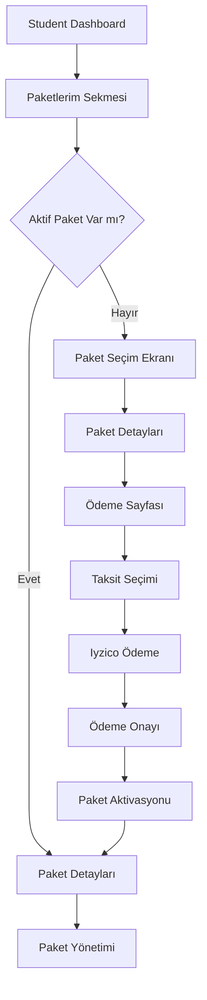

# Student Dashboard E-Ticaret Sistemi - Ürün Gereksinimleri Dokümanı

## 1. Ürün Genel Bakışı

Student Dashboard için entegre e-ticaret sistemi, öğrencilerin eğitim paketlerini görüntüleyebileceği, satın alabileceği ve yönetebileceği kapsamlı bir platformdur. Sistem, Iyzico ödeme entegrasyonu ile güvenli online ödeme işlemlerini destekler ve 12 taksit seçeneği sunar.

Sistem, öğrencilerin eğitim ihtiyaçlarını karşılamak için tasarlanmış olup, kullanıcı dostu arayüzü ile eğitim paketlerine kolay erişim sağlar. Mevcut packages sayfasındaki içerikler student dashboard'a entegre edilerek tutarlı bir kullanıcı deneyimi oluşturulur.

## 2. Temel Özellikler

### 2.1 Kullanıcı Rolleri

| Rol | Kayıt Yöntemi | Temel Yetkiler |
|-----|---------------|----------------|
| Öğrenci | Email kayıt | Paket görüntüleme, satın alma, paket yönetimi |
| Sistem Yöneticisi | Admin paneli | Paket yönetimi, ödeme takibi, kullanıcı yönetimi |

### 2.2 Özellik Modülleri

Sistem aşağıdaki ana sayfalardan oluşur:

1. **Student Dashboard**: Ana kontrol paneli, paket durumu özeti, hızlı erişim menüleri
2. **Paketlerim Sekmesi**: Aktif paket görüntüleme, yeni paket seçimi, paket geçmişi
3. **Paket Seçim Sayfası**: Mevcut eğitim paketleri, özellik karşılaştırması, fiyat bilgileri
4. **Ödeme Sayfası**: Iyzico entegrasyonu, taksit seçenekleri, güvenli ödeme formu
5. **Paket Yönetim Sayfası**: Aktif paket detayları, kullanım istatistikleri, yenileme seçenekleri

### 2.3 Sayfa Detayları

| Sayfa Adı | Modül Adı | Özellik Açıklaması |
|-----------|-----------|--------------------|
| Student Dashboard | Paketlerim Sekmesi | Aktif paket durumu kontrolü, paket bilgilerini görüntüleme, yeni paket satın alma yönlendirmesi |
| Student Dashboard | Paket Durumu Widget'ı | Aktif paket adı, kalan süre, kullanım oranı, hızlı yenileme butonu |
| Paket Seçim | Paket Listesi | Packages sayfasından entegre edilen 2 eğitim paketi, özellik karşılaştırması, fiyat bilgileri |
| Paket Seçim | Paket Detayları | Her paket için detaylı açıklama, içerik listesi, süre bilgisi, fiyat ve taksit seçenekleri |
| Ödeme Sayfası | Iyzico Entegrasyonu | Güvenli ödeme formu, kredi kartı bilgileri, 12 taksit seçeneği, ödeme onayı |
| Ödeme Sayfası | Ödeme Özeti | Seçilen paket bilgileri, toplam tutar, taksit detayları, güvenlik sertifikaları |
| Paket Yönetim | Aktif Paket Detayları | Paket içeriği, erişim linkleri, kullanım istatistikleri, destek iletişim bilgileri |
| Paket Yönetim | Paket Geçmişi | Geçmiş satın alımlar, fatura indirme, ödeme geçmişi |

## 3. Temel Süreçler

### Öğrenci Akışı

1. **Paket Kontrol Süreci**: Öğrenci dashboard'a giriş yapar → Paketlerim sekmesine tıklar → Sistem aktif paket durumunu kontrol eder → Aktif paket varsa paket detayları gösterilir, yoksa paket seçim ekranı açılır

2. **Paket Satın Alma Süreci**: Öğrenci paket seçim ekranında paketi seçer → Paket detayları ve fiyat bilgileri görüntülenir → Ödeme sayfasına yönlendirilir → Taksit seçeneği belirlenir → Iyzico ile ödeme işlemi tamamlanır → Paket aktif hale gelir

3. **Paket Yönetim Süreci**: Öğrenci aktif paketini görüntüler → Paket içeriğine erişir → Kullanım istatistiklerini takip eder → Paket yenileme veya upgrade işlemi yapar

## 4. Kullanıcı Arayüzü Tasarımı

### 4.1 Tasarım Stili

- **Ana Renkler**: Mavi (#3B82F6), Beyaz (#FFFFFF), Gri tonları (#F3F4F6, #6B7280)
- **İkincil Renkler**: Yeşil (#10B981) başarı mesajları için, Kırmızı (#EF4444) hata mesajları için
- **Buton Stili**: Yuvarlatılmış köşeler (rounded-lg), hover efektleri, gradient arka planlar
- **Font**: Inter font ailesi, başlıklar için 24-32px, içerik için 14-16px
- **Layout Stili**: Card-based tasarım, üst navigasyon, sidebar menü, responsive grid sistem
- **İkon Stili**: Lucide React ikonları, 20-24px boyutunda, tutarlı çizgi kalınlığı

### 4.2 Sayfa Tasarım Genel Bakışı

| Sayfa Adı | Modül Adı | UI Elementleri |
|-----------|-----------|----------------|
| Student Dashboard | Paketlerim Sekmesi | Tab navigasyon, aktif paket card'ı, mavi gradient arka plan, "Paket Satın Al" CTA butonu |
| Paket Seçim | Paket Kartları | 2 kolonlu grid layout, paket karşılaştırma tablosu, fiyat vurgusu, "Seç" butonları |
| Ödeme Sayfası | Ödeme Formu | 2 kolonlu layout (form + özet), Iyzico güvenlik logoları, taksit dropdown menüsü |
| Paket Yönetim | Paket Dashboard | Progress bar'lar, kullanım istatistikleri, hızlı erişim butonları, bildirim alanı |

### 4.3 Responsive Tasarım

Sistem mobile-first yaklaşımla tasarlanmıştır. Tablet ve mobil cihazlarda touch-friendly butonlar, kolay navigasyon ve optimize edilmiş form alanları kullanılır. Tüm sayfalar 320px'den 1920px'e kadar tüm ekran boyutlarında mükemmel görüntülenir.