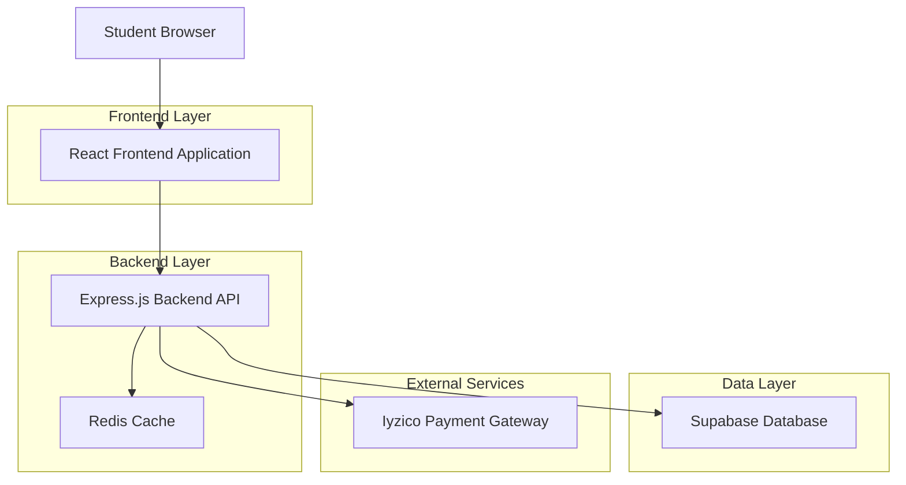
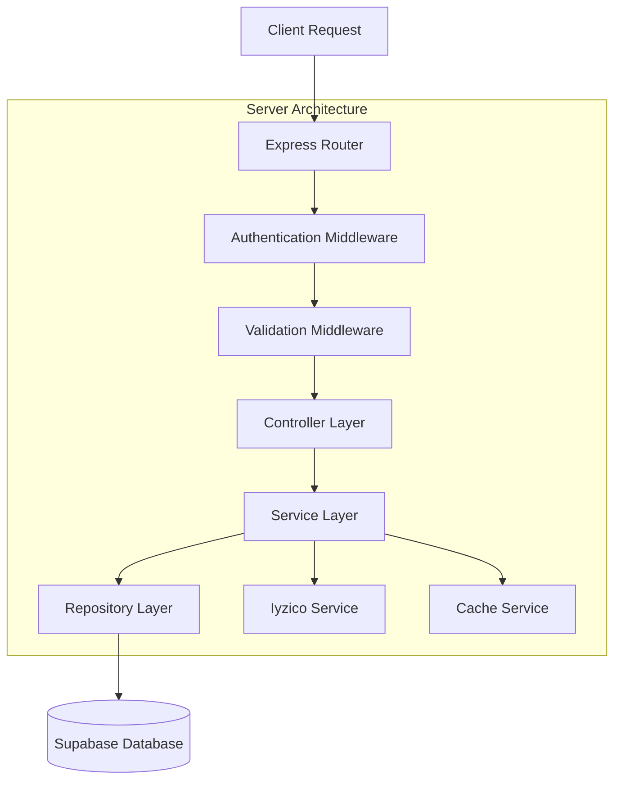
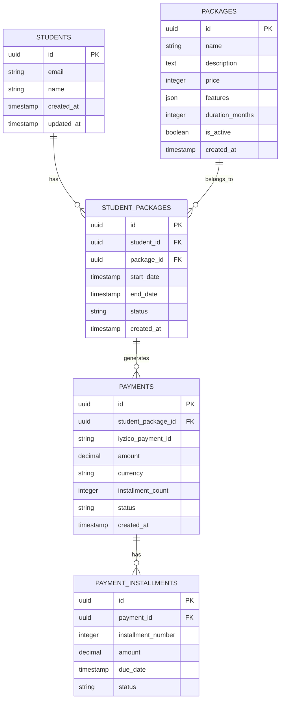

# Student Dashboard E-Ticaret Sistemi - Teknik Mimari Dokümanı

## 1. Mimari Tasarım



## 2. Teknoloji Açıklaması

- Frontend: React@18 + TypeScript + TailwindCSS@3 + Vite
- Backend: Express@4 + TypeScript + Node.js
- Database: Supabase (PostgreSQL)
- Payment: Iyzico Payment Gateway
- Cache: Redis (ödeme session'ları için)
- Authentication: Supabase Auth

## 3. Route Tanımları

| Route | Amaç |
|-------|------|
| /student-dashboard | Ana öğrenci dashboard sayfası |
| /student-dashboard/packages | Paketlerim sekmesi, aktif paket görüntüleme |
| /student-dashboard/package-selection | Paket seçim sayfası |
| /student-dashboard/payment | Ödeme sayfası ve Iyzico entegrasyonu |
| /student-dashboard/package-management | Aktif paket yönetimi |
| /student-dashboard/payment-history | Ödeme geçmişi |

## 4. API Tanımları

### 4.1 Temel API

**Paket Yönetimi**
```
GET /api/student/packages
```

Request:
| Parametre | Tip | Zorunlu | Açıklama |
|-----------|-----|---------|----------|
| student_id | string | true | Öğrenci kimliği |

Response:
| Parametre | Tip | Açıklama |
|-----------|-----|----------|
| active_package | object | Aktif paket bilgileri |
| available_packages | array | Satın alınabilir paketler |
| package_history | array | Geçmiş paket satın alımları |

Örnek Response:
```json
{
  "active_package": {
    "id": "pkg_123",
    "name": "LGS Destek Paketi",
    "start_date": "2024-01-15",
    "end_date": "2024-12-15",
    "status": "active"
  },
  "available_packages": [
    {
      "id": "pkg_lgs",
      "name": "LGS Destek Paketi",
      "price": 34999,
      "features": ["Canlı Dersler", "Soru Bankası"]
    }
  ]
}
```

**Ödeme İşlemleri**
```
POST /api/payment/initialize
```

Request:
| Parametre | Tip | Zorunlu | Açıklama |
|-----------|-----|---------|----------|
| package_id | string | true | Seçilen paket kimliği |
| installment | number | true | Taksit sayısı (1-12) |
| student_id | string | true | Öğrenci kimliği |

Response:
| Parametre | Tip | Açıklama |
|-----------|-----|----------|
| payment_token | string | Iyzico ödeme token'ı |
| checkout_form_content | string | Iyzico ödeme formu HTML içeriği |

```
POST /api/payment/callback
```

Request:
| Parametre | Tip | Zorunlu | Açıklama |
|-----------|-----|---------|----------|
| token | string | true | Iyzico callback token'ı |
| conversationId | string | true | İşlem takip kimliği |

Response:
| Parametre | Tip | Açıklama |
|-----------|-----|----------|
| status | string | Ödeme durumu (success/failed) |
| package_activation | object | Aktifleştirilen paket bilgileri |

## 5. Sunucu Mimarisi



## 6. Veri Modeli

### 6.1 Veri Modeli Tanımı



### 6.2 Veri Tanımlama Dili

**Packages Tablosu (packages)**
```sql
-- Paketler tablosu
CREATE TABLE packages (
    id UUID PRIMARY KEY DEFAULT gen_random_uuid(),
    name VARCHAR(255) NOT NULL,
    description TEXT,
    price INTEGER NOT NULL, -- Kuruş cinsinden
    features JSONB NOT NULL DEFAULT '[]',
    duration_months INTEGER NOT NULL DEFAULT 12,
    is_active BOOLEAN DEFAULT true,
    created_at TIMESTAMP WITH TIME ZONE DEFAULT NOW(),
    updated_at TIMESTAMP WITH TIME ZONE DEFAULT NOW()
);

-- İndeksler
CREATE INDEX idx_packages_active ON packages(is_active);
CREATE INDEX idx_packages_price ON packages(price);

-- Başlangıç verileri
INSERT INTO packages (name, description, price, features, duration_months) VALUES
('LGS Destek Paketi', 'LGS sınavına hazırlık için kapsamlı destek paketi', 3499900, 
 '["Canlı Dersler", "Soru Bankası", "Deneme Sınavları", "Bireysel Takip", "Akademik Destek Seminerleri"]', 12),
('Okul Destek Paketi', 'Okul derslerinde başarı için destek paketi', 2999900,
 '["Ders Takibi", "Ödev Yardımı", "Soru Çözümü", "Bireysel Danışmanlık", "Akademik Destek Seminerleri"]', 12);
```

**Student Packages Tablosu (student_packages)**
```sql
-- Öğrenci paketleri tablosu
CREATE TABLE student_packages (
    id UUID PRIMARY KEY DEFAULT gen_random_uuid(),
    student_id UUID NOT NULL REFERENCES auth.users(id),
    package_id UUID NOT NULL REFERENCES packages(id),
    start_date TIMESTAMP WITH TIME ZONE NOT NULL,
    end_date TIMESTAMP WITH TIME ZONE NOT NULL,
    status VARCHAR(20) DEFAULT 'active' CHECK (status IN ('active', 'expired', 'cancelled')),
    created_at TIMESTAMP WITH TIME ZONE DEFAULT NOW(),
    updated_at TIMESTAMP WITH TIME ZONE DEFAULT NOW()
);

-- İndeksler
CREATE INDEX idx_student_packages_student_id ON student_packages(student_id);
CREATE INDEX idx_student_packages_status ON student_packages(status);
CREATE INDEX idx_student_packages_dates ON student_packages(start_date, end_date);

-- RLS Politikaları
ALTER TABLE student_packages ENABLE ROW LEVEL SECURITY;
CREATE POLICY "Students can view own packages" ON student_packages
    FOR SELECT USING (auth.uid() = student_id);
```

**Payments Tablosu (payments)**
```sql
-- Ödemeler tablosu
CREATE TABLE payments (
    id UUID PRIMARY KEY DEFAULT gen_random_uuid(),
    student_package_id UUID NOT NULL REFERENCES student_packages(id),
    iyzico_payment_id VARCHAR(255),
    iyzico_conversation_id VARCHAR(255),
    amount DECIMAL(10,2) NOT NULL,
    currency VARCHAR(3) DEFAULT 'TRY',
    installment_count INTEGER DEFAULT 1,
    status VARCHAR(20) DEFAULT 'pending' CHECK (status IN ('pending', 'success', 'failed', 'cancelled')),
    payment_method VARCHAR(50),
    created_at TIMESTAMP WITH TIME ZONE DEFAULT NOW(),
    updated_at TIMESTAMP WITH TIME ZONE DEFAULT NOW()
);

-- İndeksler
CREATE INDEX idx_payments_student_package ON payments(student_package_id);
CREATE INDEX idx_payments_iyzico_id ON payments(iyzico_payment_id);
CREATE INDEX idx_payments_status ON payments(status);
CREATE INDEX idx_payments_created_at ON payments(created_at DESC);

-- RLS Politikaları
ALTER TABLE payments ENABLE ROW LEVEL SECURITY;
CREATE POLICY "Students can view own payments" ON payments
    FOR SELECT USING (
        EXISTS (
            SELECT 1 FROM student_packages sp 
            WHERE sp.id = payments.student_package_id 
            AND sp.student_id = auth.uid()
        )
    );
```

**Payment Installments Tablosu (payment_installments)**
```sql
-- Taksit tablosu
CREATE TABLE payment_installments (
    id UUID PRIMARY KEY DEFAULT gen_random_uuid(),
    payment_id UUID NOT NULL REFERENCES payments(id),
    installment_number INTEGER NOT NULL,
    amount DECIMAL(10,2) NOT NULL,
    due_date TIMESTAMP WITH TIME ZONE NOT NULL,
    status VARCHAR(20) DEFAULT 'pending' CHECK (status IN ('pending', 'paid', 'overdue')),
    paid_at TIMESTAMP WITH TIME ZONE,
    created_at TIMESTAMP WITH TIME ZONE DEFAULT NOW()
);

-- İndeksler
CREATE INDEX idx_installments_payment_id ON payment_installments(payment_id);
CREATE INDEX idx_installments_due_date ON payment_installments(due_date);
CREATE INDEX idx_installments_status ON payment_installments(status);

-- Unique constraint
ALTER TABLE payment_installments ADD CONSTRAINT unique_payment_installment 
    UNIQUE (payment_id, installment_number);
```